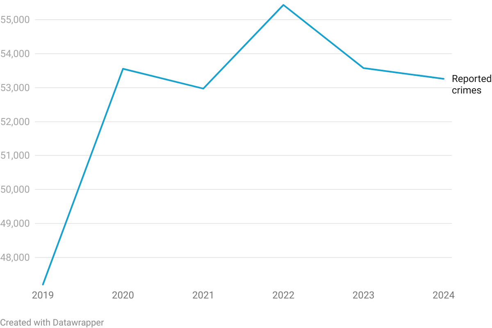

******

### Reference

DataWrapper API documentation:
https://developer.datawrapper.de/docs/getting-started 

DatawRappr package documentation:
https://munichrocker.github.io/DatawRappr/index.html

******


### Set up

Install the needed packages

* If you are doing this at home, uncomment the two lines below
* These should already be installed on the NICAR computers
```{r}
# install.packages("devtools") # if not already installed on your system
# devtools::install_github("munichrocker/DatawRappr")

```


##### Call library and set API key
You will need to have a DataWrapper API token for this to work.

* Open your DataWrapper account, go to Settings -> API-Tokens
* Create a new token and enter it below.

```{r}
library(DatawRappr)
library(tidyverse)
#datawrapper_auth(api_key =  "sOa38CEKU6BxzY7v2OS7KwL3PN2ZZO9qNmjIty4hqa82LZMJgnW7D90Wx9uHPIqA")

```


#### Call in data and display head
We are working with Minneapolis crime data from 2015 through early 2025.
```{r}

crime_data <- read.csv("mn-crime-data.csv")
head(crime_data)

```


******
### Work the data

Use Lubridate to extract the year from the Reported_Date column and put it in a new column called "year"
```{r}
crime_data$Year <- year(crime_data$Reported_Date)

```


Filter out 2025 data since it is incomplete
```{r}
crime_data <- crime_data %>% 
  filter(Year < 2025)
```


Count number of crimes per year using dyplr -- this is the data for our chart
```{r}
crime_summary <- crime_data %>%
  count(Year)

```

CHECK: Count the number of rows in the crime_data and sum the n col in crime_summary as a double check (should match)

```{r}
nrow(crime_data)
sum(crime_summary$n)
```


Rename the n column to "Reported Crimes" (this will be helpful for our popups in the DataWrapper)
```{r}
crime_summary <- crime_summary %>%
  rename("Reported crimes" = "n")
```


******

### Create our first chart 

We will make a line chart showing reported crimes per year

Create a new chart and assign it to the variable "my_chart" (this way, you don't need to worry about the ID)
```{r}
my_chart <- dw_create_chart()
```


Add our data to chart
```{r}
dw_data_to_chart(crime_summary, my_chart)
```

You could stop here. This is actually pretty useful. We have sent our data from R to DataWrapper without the need to export / import. 

But we can take this a lot further. Let's update and make changes to our chart right from R.


Update the chart-- Here we add a headline and chatter
```{r}
dw_edit_chart(my_chart, title = "Crime in Minneapolis hit a three-year low in 2024", 
intro = "Reported crimes in the city between 2019 and 2024 hit a high mark in 2022 but have been on the decline since.", source_name = "Open Data Minneapolis")
```


Next, we can publish our graphic
```{r}
dw_publish_chart(my_chart)
```

Or export as an image
```{r}
png_chart <- dw_export_chart(my_chart, type = "png")

magick::image_write(png_chart, "line-chart.png")
```


It should look like this:


```{r}
```


There are a few things I would change here:

* I would increase the scale of the y-axis. The current scale makes the change between years look bigger than it actually is.
* The way dates are formatted in the popups. Instead of "2019 Jan 1" I would change it to just say "2019" - which is what we are actually visualizing.

We could make these changes pretty easily in DataWrapper, which is a fine way to do it. Or we could further modify our graphic directly from R. Let's move on and see how that is done.


****

### On your own
Take what I did above and duplicate. You can copy into your own document or just hit play on the boxes and run through. Try to understand what is happening in each step by reading the comments and looking at the documentation. 

****


### Create a bar chart

For our second chart, let's use the same data to make a bar chart of reported crimes per year and make some design modifications.


Create a chart, choose the chart type and add a title 

* We will make a bar chart this time with "d3-bars"
* For visualization types, see: https://developer.datawrapper.de/docs/chart-types

```{r}
bar_chart <- dw_create_chart(
  type="d3-bars",
  title="Minneapolis reported crime, 2019-2024"
)
```

Add our data
```{r}
dw_data_to_chart(crime_summary, bar_chart)
```


Update with a new headline, chatter and source
```{r}
dw_edit_chart(bar_chart, title = "Crime in Minneapolis hit a three-year low in 2024", 
intro = "Reported crimes in the city between 2019 and 2024 hit a high mark in 2022 but have been on the decline since.", source_name = "Open Data Minneapolis")
```


Now, let's take a look at our chart's metadata-- this is good key to what can be changed.

```{r}
dw_retrieve_chart_metadata(bar_chart)
```

It can take a little work to figure out what metadata values to change. Sometimes the documentation will help. 

Modify some of the attributes of the graphic:

* Add a byline
* Change the bar color
* Make the bars thick
* Align the labels to the right

```{r}
dw_edit_chart(bar_chart, 
              byline = "Adam Marton",
              visualize = list(
                "base-color" = "#a47764",
                "thick" = "true",
                "value-label-alignment" = "right"
                )
              )
```


Publish our new graphic
```{r}
dw_publish_chart(bar_chart)
```


### Templating

Let's duplicate that chart add new data. You can use this method to create your own templates.  

For our next graphic, let's look at the Offense Category column. We will visualize what the top 10 categories were in 2024.

****

#### First, some quick data work

Lets make a new dataframe called "crimes_2024" and filter the crime data for just 2024
```{r}
crimes_2024 <- crime_data %>% 
  filter(Year == 2024)
```


Next, we count the number of crimes in each "offense category" in 2024 using dyplr
```{r}
crime_offense_summary <- crimes_2024 %>%
  count(Offense_Category)
```


Then we sort the column number (n) column by descending and reduce to just the top 10 using slice
```{r}
crime_offense_summary <- crime_offense_summary %>%
    arrange(desc(n)) %>%
    slice(1:10) 
```

This the data we will use for our new (duplicate) chart

****

#### Duplicate the bar chart we made above and add in our new data


Duplicate the bar chart

**We need the chart id for this. We can get it above from when we first made the chart or from the chart URL
```{r}
offense_chart <- dw_copy_chart(copy_from = "INSERT CHART ID FROM ABOVE")
```

Update the duplicated chart with the new data
```{r}
dw_data_to_chart(crime_offense_summary, offense_chart)

```

Update text
```{r}
dw_edit_chart(offense_chart, title = "Top 10 highest categories of crime offenses in Minneapolis in 2024", 
intro = "Almost 13,000 larceny and theft offenses and over 8,000 assault offenses were reported.", source_name = "Open Data Minneapolis")
```


Let's take a look at the chart now and decide what we need to change. You can open it in DataWrapper or publish and look in the browser.


Publish
```{r}
dw_publish_chart(offense_chart)
```

Next, look at the metadata
```{r}
dw_retrieve_chart_metadata(offense_chart)
```


Modify some of the attributes of the graphic:

* change the bar color
* sort the bars by value
* Add lines between the bars
* Add a background behind the bars
* Put the labels and bars of seperate lines ("block labels"?)
* align the labels to the right

```{r}
dw_edit_chart(offense_chart, 
              visualize = list(
                "base-color" = "#8ACE00",
                "sort-bars" = "true",
                "rules" = "true",
                "background" = "true",
                "block-labels" = "true",
                "value-label-alignment" = "right"
                )
              )
```


Republish
```{r}
dw_publish_chart(offense_chart)
```

How might something like this be useful?
How could you use it to save time during production tasks?


***

### On your own
Can you take what we learned above and create a bar chart that shows the neighborhoods with the highest reported crimes in 2024? Style it however you like. Be sure to include a headline, chatter and source.

***


### Functions

Let's make a function that will automatically generate a chart.

Here is a simple function that creates a chart looking at reported crimes by year in precinct 1. Read through the comments in the function to see how it works.
```{r}

my_function <- function() {
  
  #make a new data frame for a precinct
  precinct_data <- crime_data %>% filter(Precinct== 1)

  #count number of arrests per year in that precinct
  precinct_summary <- precinct_data %>%count(Year)
  
  #create new chart
  my_chart <- dw_create_chart(
  type="d3-bars",
  )

  #add data
  dw_data_to_chart(precinct_summary, my_chart)

  #edit chart
  dw_edit_chart(my_chart, title = paste("Reported crimes by year in Minneapolis Precinct 1"), source_name = "Open Data Minneapolis")
  
  #publish
  dw_publish_chart(my_chart)
}

#Call the function to run it
my_function()

```


We can make this much more useful with one change -- making the specific precinct an argument in the function.
Changes are indicted in the comments below

```{r}

#add an argument called precinct
my_function <- function(precinct) {
  
  #instead of naming the precinct here, call the argument value
  precinct_data <- crime_data %>% filter(Precinct == precinct)

  precinct_summary <- precinct_data %>%count(Year)
  
  my_chart <- dw_create_chart(
  type="d3-bars",
  )

  dw_data_to_chart(precinct_summary, my_chart)

  #Again, call in the argument value instead of naming the specific precinct
  dw_edit_chart(my_chart, title = paste("Reported crimes by year in Minneapolis Precinct", precinct), source_name = "Open Data Minneapolis")
  
  dw_publish_chart(my_chart)
}

#Call the function to run it
my_function("2")
```

Now we can use this function to create a graphic for any precinct just by changing the argument when we call the function.

****

#### Add a loop

We can wrap our function in a loop -- also called a "for statement" -- to quickly create a graphic for all precincts!

```{r}
for(precinct in unique(crime_data$Precinct)) {
  my_function(precinct)
}

```

This says: for each unique vaule in the Precinct column of our data, execute my_function and put the unique precinct name as the function's argument.

We could use this to create dozens or even hundreds of charts at at time.

****

### Make a symbol map


#### Our Data

In this example, we will pull crimes from the last seven days.

We will need to fake it a little bit since we only have data through the end of 2024. Follow the comments below to see how this works.

```{r}
#First we set today's date
  # let's fake the current date to make this example immortal:
now = as.Date("12/31/2024", format = "%m/%d/%Y")
  # however, you should replace it with:
  # now = Sys.Date()

#Next, let's make a new dataframe that only shows crimes seven days before "now"
crimes_last_7 <- subset(crimes_2024, crimes_2024$Reported_Date > now-7)

```

#### Make the map

Create a new symbol map.
```{r}
new_symbol_chart <- dw_create_chart(
  title = "Crimes in Minneapolis in the last seven days", 
  type = "d3-maps-symbols"
  )

```

First, you have to decide, which base map to use. It is identified by the id-column.

You can use dplyr’s View() to get an interactive table of available maps and search for what you are looking for. 
```{r}
view(dw_basemaps)
```
We will use a basemap of Minneapolis neighborhoods, which has the id "minneapolis-neighborhoods"


Connect our data to the chart
```{r}
dw_data_to_chart(crimes_last_7, chart_id = new_symbol_chart)
```

Edit the chart. 

* We need to include the latitude and longitude (which, luckily, we have in our data already so there is no geocoding needed)
* We also include "values" which will color our symbols based on a column
* Finally, we identify the basemap.
```{r}
dw_edit_chart(new_symbol_chart, 
              axes = list(
                lat = "Latitude", 
                lon = "Longitude",
                values = "Offense_Category"
                ), 
              visualize = list(
                basemap = "minneapolis-neighborhoods"
                )
              )
```


Add / Edit tooltips

* Title shows above the tooltip and body is the main text
* Refer to your data columns in doouble brackets {{ }}
* You have to define your variables in the fields list. It is easiest just to name the variables after the columns.

```{r}
dw_edit_chart(new_symbol_chart, visualize = list(
  tooltip = list(
    body = "Reported Date: {{ reported_date }}<br> Address: {{ address }}",
    title = "{{ offense }}",
    fields = list(
      "reported_date" = "reported_date",
      "offense" = "offense",
      "address" = "address"
    ),
    enabled = "TRUE"
    )))
```
It is easiest to open up datawrapper at this point to edit / tweak the leaged. You could also do it via the metadata if you like.

Publish
```{r}
dw_publish_chart(new_symbol_chart)
```

****

### On your own
Create your own map. Look at the data and think about what might be interesting to visualize on a map. Prepare your data and then follow the workflow above to create your own symbol / dot map. Refer to the documentation as needed (see the top of this doc for links). Here are a few ideas:

1. Map all of the assaults that occurred in November 2024
2. Map all of the crimes that occurred in the Powderhorn Park neighborhood in the summer of 2024
3. Map all of the carjackings in Ward 8 in 2024
